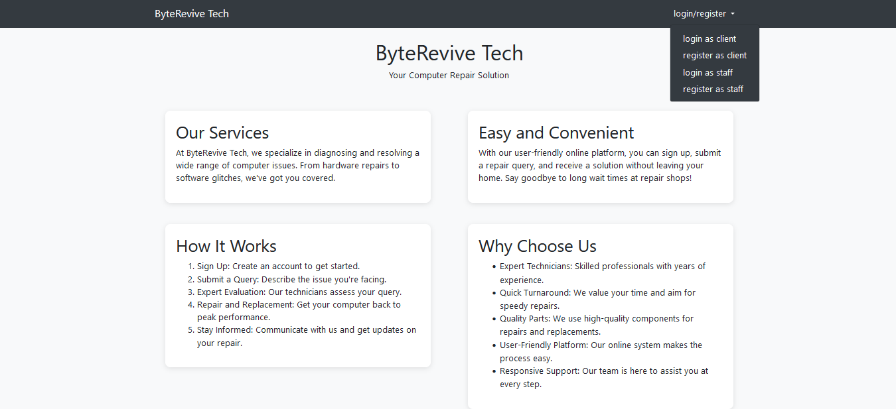
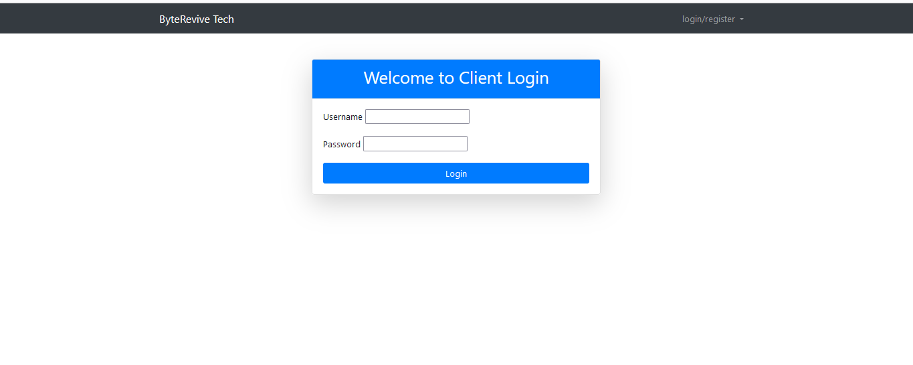
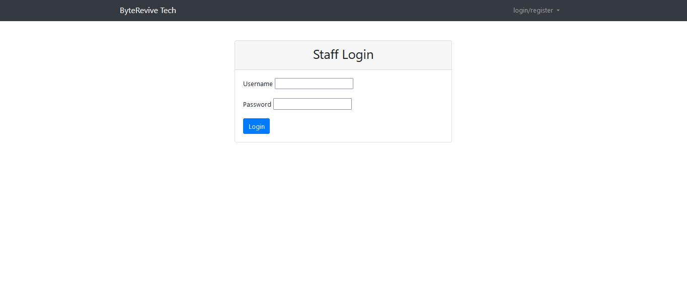
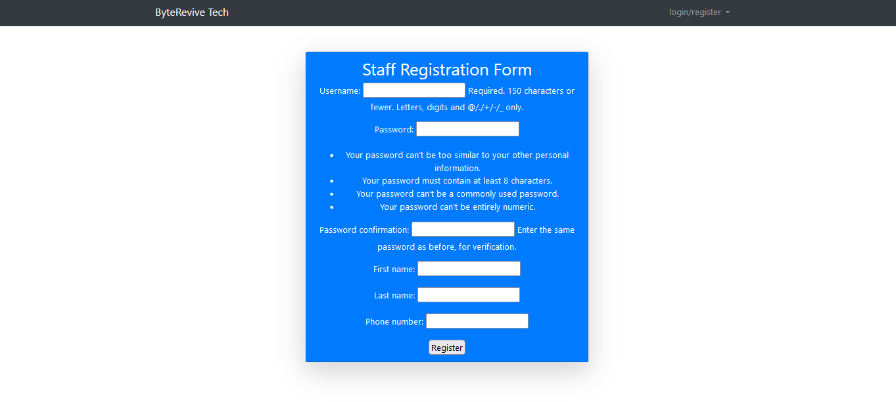
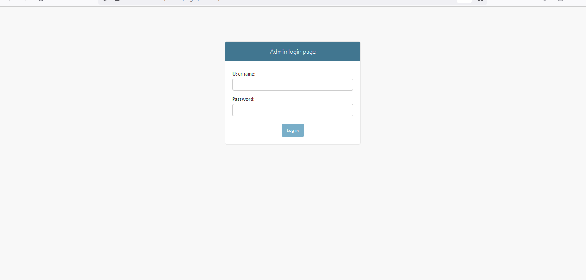
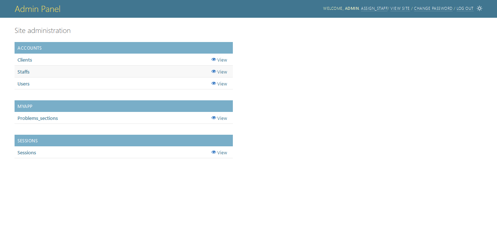
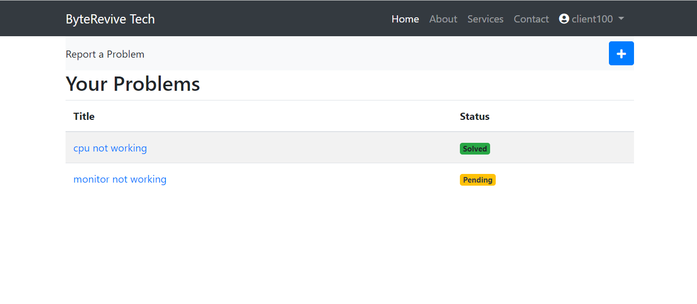
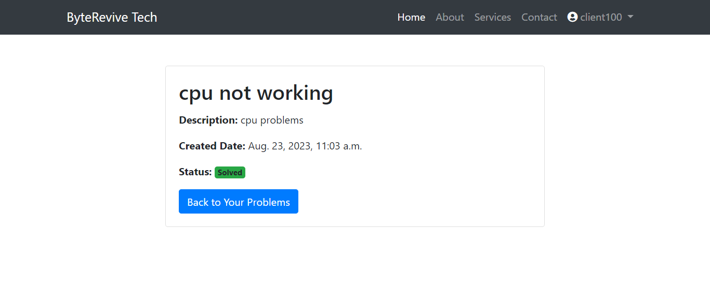
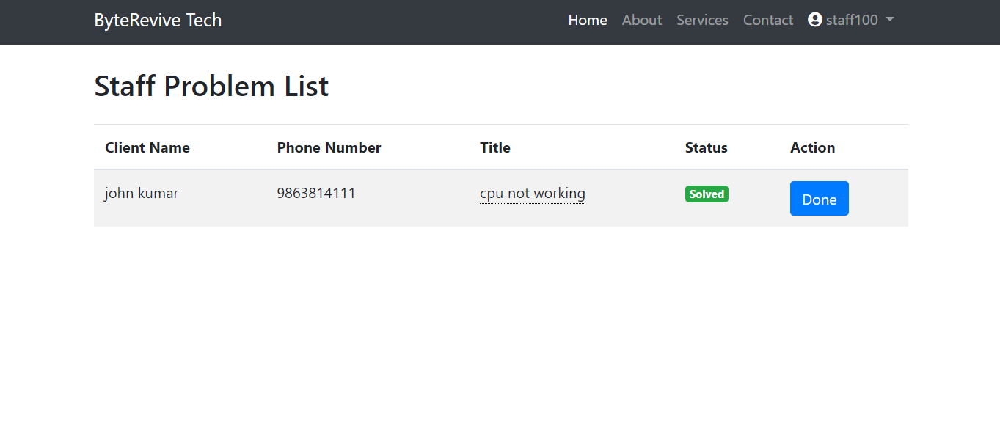
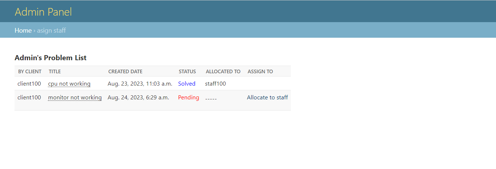

# Electronics Repair Service Store Management System

## Description
The Electronics Repair Service Store Management System is a web-based application designed to streamline the management of an electronic repair shop. It allows clients to submit repair requests, and the shop owner (admin) can assign these requests to staff members who will then visit the client's location to perform the repairs. The system provides an efficient way to manage repair tasks, track progress, enhance communication between clients and staff, and facilitate on-site repairs.

## Demo
Check out the live demo: [Electronics Repair Service Store Management System](https://brijkishor.pythonanywhere.com/)

## Features
- User Roles: Clients, Staff, and Admin.
- Client Portal: Clients can submit repair requests, view status, and communicate with staff.
- Staff Management: Admin can assign repair tasks to staff members and track their progress.
- Task Tracking: Monitor repair tasks from submission to completion.
- On-Site Repairs: Staff can reach the client's location and perform repairs on-site.
- Communication: Built-in messaging system for clients and staff to communicate about repair details.
- Responsive Design: User-friendly interface accessible on various devices.
- Secure Authentication: Login and registration required for each user role.
- Powerful ORM: Utilizes Django's Object-Relational Mapping for efficient data management.
- Database: SQLite used as the database management system.

## Technologies Used
- Django: Python web framework for backend development.
- Bootstrap: CSS framework for responsive and attractive front-end design.
- SQLite: Database management system for storing data.
- JavaScript: Enhances user experience with interactive features.
- HTML and CSS: Markup and styling of web pages.
- Font Awesome: Provides icons for a visually appealing interface.

## Getting Started
1. Clone the repository: `git clone <repository-url>`
2. Install dependencies: `pip install -r requirements.txt`
3. Run migrations: `python manage.py migrate`
4. Create a superuser: `python manage.py createsuperuser`
5. Start the development server: `python manage.py runserver`

## Usage
- Visit the admin panel to manage staff, clients, and repair tasks: `/admin`
- Clients can access their portal to submit repair requests and check the status.
- Staff can view assigned tasks, mark them as completed, and perform on-site repairs.
- Admin can assign tasks, manage staff and clients, and oversee the system.

## Contributing
Contributions are welcome! If you have suggestions or improvements, feel free to open an issue or submit a pull request.

## Acknowledgments
- Thanks to [Django](https://www.djangoproject.com/) and [Bootstrap](https://getbootstrap.com/) for their fantastic tools.
- Special thanks to our team members for their contributions.

## screenshorts

